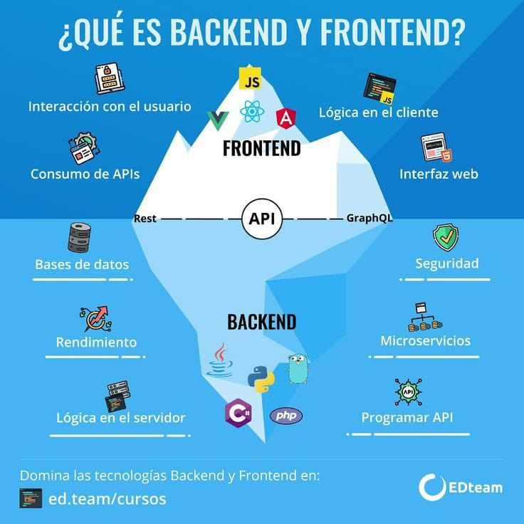

# Introducción al Desarrollo BackEnd

🤓 Aprende a entender cómo funciona el mundo del back-end y cómo las aplicaciones web funcionan en el lado de los servidores. 🧑‍💼 Obtén una introducción a los lenguajes de programación, tecnologías y tareas que son esenciales para la construcción y el mantenimiento de la infraestructura del internet. 🤓 Conoce los fundamentos de lo que sucede detrás de escena para que puedas contribuir al desarrollo y el funcionamiento de aplicaciones y servicios en línea.

## Tabla de contenido

- [Introducción al Desarrollo BackEnd](#introducción-al-desarrollo-backend)
  - [Tabla de contenido](#tabla-de-contenido)
- [Roles del Desarrollo Web](#roles-del-desarrollo-web)
  - [Los Roles Del Desarrollo Backend](#los-roles-del-desarrollo-backend)
  - [Front-End, Back-End y Full Stack](#front-end-back-end-y-full-stack)
- [Fundamentos del Back-End](#fundamentos-del-back-end)
  - [¿Cómo se construye el Back-End?](#cómo-se-construye-el-back-end)
  - [¿Cómo escoger lenguajes y frameworks para backend?](#cómo-escoger-lenguajes-y-frameworks-para-backend)
- [APIs REST](#apis-rest)
  - [¿Qué son las APIs?](#qué-son-las-apis)
  - [Estructura REST API](#estructura-rest-api)
  - [Insomnia y Postman](#insomnia-y-postman)
- [Back-End en el día a día](#back-end-en-el-día-a-día)
  - [La Nube](#la-nube)
  - [DevOps](#devops)
  - [El Servidor](#el-servidor)
  - [Cookies y Sesiones](#cookies-y-sesiones)
  - [Bases de Datos](#bases-de-datos)
- [Escalabilidad en el Backend](#escalabilidad-en-el-backend)
  - [¿Qué es el escalamiento?](#qué-es-el-escalamiento)
  - [¿Qué es la replicación?](#qué-es-la-replicación)
  - [¿Qué es la caché?](#qué-es-la-caché)
  - [Colas de tareas](#colas-de-tareas)
  - [Server-Side Rendering](#server-side-rendering)

# Roles del Desarrollo Web

👨‍💻 En el desarrollo backend, hay una variedad de roles que pueden ser desempeñados por profesionales de tecnología de la información.

## Los Roles Del Desarrollo Backend

1. 💻 **Desarrollador BackEnd**: Profesional encargado de desarrollar y mantener el lado "back-end" de una aplicación web o software. Esto incluye la implementación de la lógica del negocio, el acceso a bases de datos y la integración con otros sistemas.
   
2. 🏭 **Arquitecto BackEnd**: Profesional que se encarga de diseñar y planificar la estructura y el funcionamiento del back-end de una aplicación o sistema. Esto incluye la selección de tecnologías y frameworks apropiados y la creación de arquitecturas escalables y sostenibles.
   
3. 🛠️ **DevOps**: Profesional que se encarga de la implementación y el mantenimiento de la infraestructura y el ciclo de vida de desarrollo de software. Esto incluye tareas como la integración continua, el despliegue de aplicaciones y el monitoreo de sistemas.
   
4. 📊 **Analista de sistemas**: Profesional que se encarga de analizar los requisitos de negocio y de traducirlos en soluciones de tecnología de la información. También puede ser responsable de la documentación y el diseño de sistemas.
   
5. 🗄️**Administrador de bases de datos**: Profesional que se encarga de la administración y el mantenimiento de bases de datos. Esto incluye tareas como la optimización de consultas, la seguridad y la copia de seguridad de datos.
   
💡 Estos son solo algunos ejemplos de los roles que pueden desempeñarse en el desarrollo backend. Dependiendo de la empresa y del proyecto en particular, pueden haber otras responsabilidades o roles específicos que deban ser desempeñados.

## Front-End, Back-End y Full Stack

- 🖥️ **FrontEnd**: Es lo que ves y usas cuando navegas por Internet. Desarrolladores FrontEnd utilizan lenguajes de programación como HTML, CSS y JavaScript para hacer que las páginas web se vean y funcionen.
  
- 💾 **BackEnd**: Es lo que sucede detrás de escena cuando navegas por Internet. Desarrolladores backend utilizan lenguajes de programación como Python, Java o PHP para hacer que sucedan cosas en Internet.
  
- 🖥️💾 **Full Stack**: Son profesionales que saben cómo hacer tanto el FrontEnd como el backend de las páginas web y aplicaciones.

# Fundamentos del Back-End

## ¿Cómo se construye el Back-End?

Contenido de la subsección 3

## ¿Cómo escoger lenguajes y frameworks para backend?

Contenido de la subsección 4

# APIs REST

## ¿Qué son las APIs?

Contenido de la subsección 3

## Estructura REST API

Contenido de la subsección 4

## Insomnia y Postman

Contenido de la subsección 4

# Back-End en el día a día

## La Nube

Contenido de la subsección 3

## DevOps

Contenido de la subsección 4

## El Servidor

Contenido de la subsección 4
## Cookies y Sesiones

Contenido de la subsección 4
## Bases de Datos

Contenido de la subsección 4

# Escalabilidad en el Backend

## ¿Qué es el escalamiento?

Contenido de la subsección 3

## ¿Qué es la replicación?

Contenido de la subsección 4

## ¿Qué es la caché?

Contenido de la subsección 4
## Colas de tareas

Contenido de la subsección 4
## Server-Side Rendering

Contenido de la subsección 4